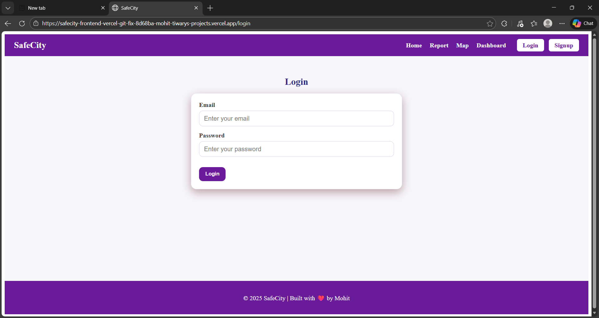
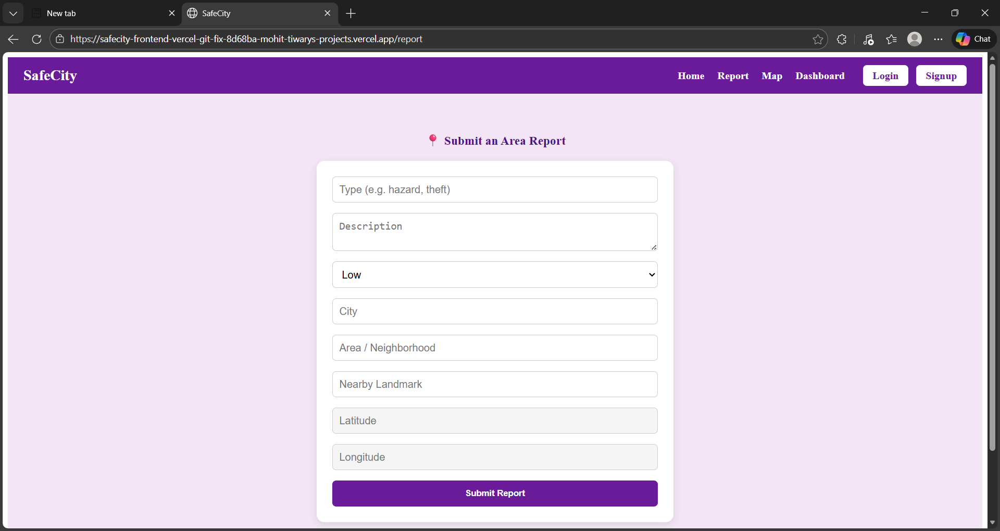
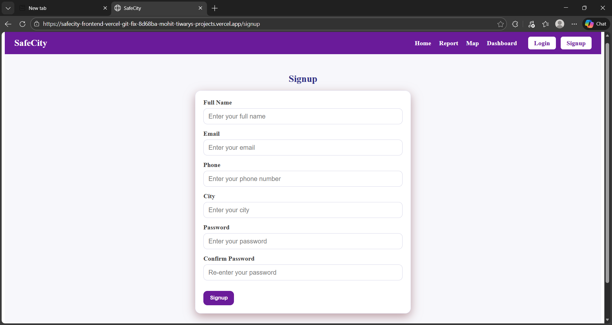
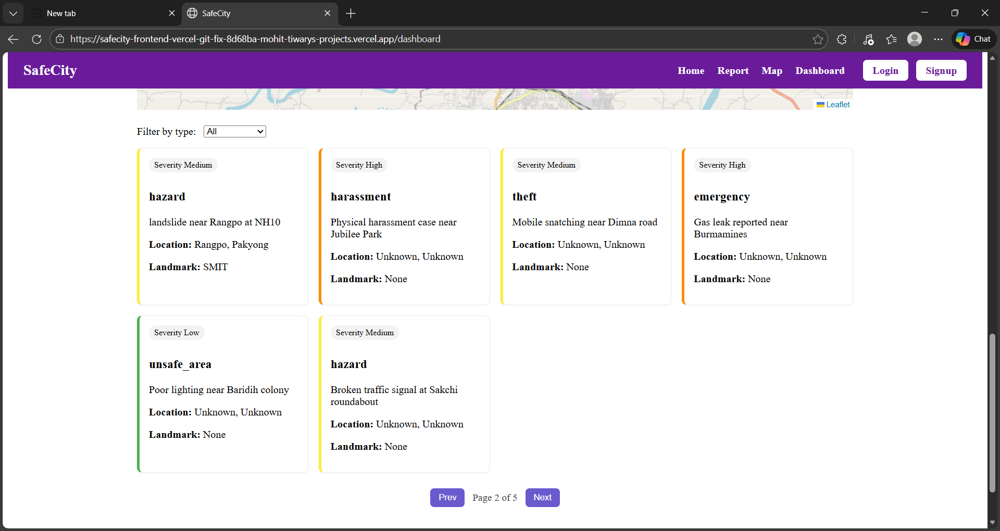
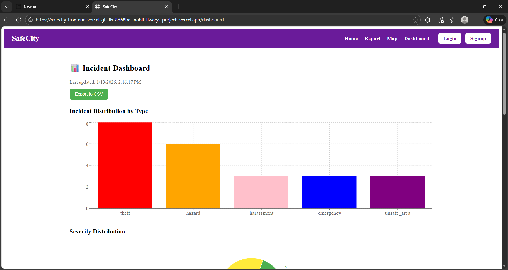
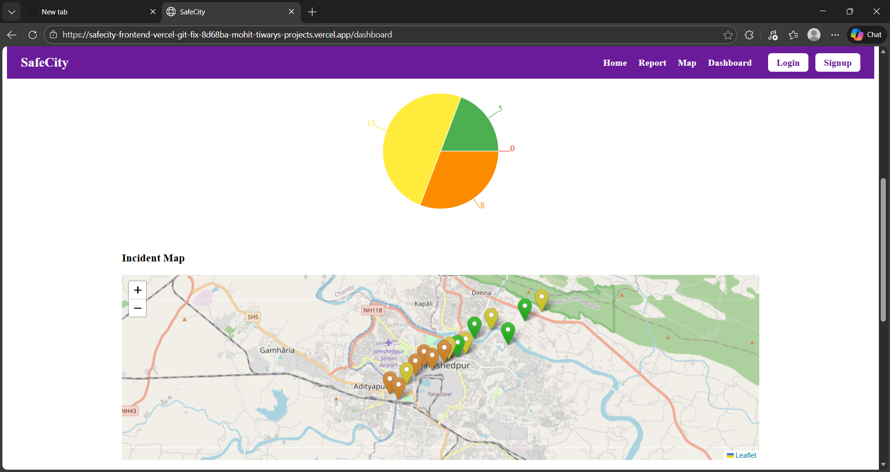

```markdown
# 🛡️ SafeCity — Community Safety Reporting with Responsible AI

## 📌 Overview
SafeCity is a full-stack platform designed to empower communities through anonymous incident reporting and transparent safety visualization. Built with **React**, **FastAPI**, **MongoDB**, and **scikit-learn**, the system integrates geospatial mapping, NLP classification, and privacy-conscious design to deliver a recruiter-ready showcase of engineering and data science skills.

---

## 🚀 Features
- 📍 **Incident Reporting**: Citizens can submit reports with type, severity, description, and location.
- 🧠 **NLP Classification**: Automatically predicts incident type using TF-IDF + logistic regression.
- 🔥 **Geospatial Heatmap**: Visualizes hotspots and distribution of incidents.
- 🧮 **Fairness Dashboard**: Tracks distribution, lag, and false positive rates for responsible AI.
- 🗺️ **Geo-Fuzzing**: Adds ~150m noise to coordinates before public display for privacy.
- 🖼️ **Media Redaction**: Optional face/license plate blur via Cloudinary.
- 🔐 **Consent-Based Public Map**: Only shows incidents where users opt-in for public visibility.

---

## 🛠️ Tech Stack
| Layer        | Technology |
|--------------|------------|
| **Frontend** | React (Vite), TypeScript, React-Leaflet |
| **Backend**  | FastAPI, Pydantic |
| **Database** | MongoDB Atlas |
| **ML/NLP**   | scikit-learn (TF-IDF + Logistic Regression) |
| **Deployment** | Vercel (Frontend), Render (Backend) |

---

## 🌍 Live Demo
👉 [Try SafeCity here] https://safecity-frontend-vercel.vercel.app  

---

## 📸 Screenshots
### 🔐 Login Form


### 📝 Report Form


### 🧾 Signup Form


### 📊 Dashboard – Incident Table


### 📈 Dashboard – Bar Chart


### 🧠 Dashboard – Pie Chart + Heatmap


---

## 📂 Project Structure
```
SafeCity/
├── backend/
│   ├── core/db.py
│   ├── routes/incidents.py
│   ├── services/nlp.py
│   └── utils/geofuzz.py
├── frontend/
│   ├── src/components/Navbar.tsx
│   ├── src/components/Footer.tsx
│   ├── src/pages/ReportForm.tsx
│   ├── src/pages/Dashboard.tsx
│   ├── src/pages/MapPage.tsx
│   └── App.tsx
├── screenshots/
│   ├── Login_form.png
│   ├── Report_form.png
│   ├── Signup_form.png
│   ├── Dashboard_incidents.png
│   ├── Dashboard_barchart.png
│   └── Dashboard_pie_heatmap.png
├── README.md
├── requirements.txt
├── package.json
└── vercel.json / render.yaml
```

---

## ⚙️ Run Locally
### Backend
```bash
cd backend
pip install -r requirements.txt
uvicorn app.main:app --reload
```

### Frontend
```bash
cd frontend
npm install
npm run dev
```

Set environment variable:
```bash
VITE_API_URL=http://localhost:8000
```

---

## 🔐 Privacy & Responsible AI
- ✅ Geo-fuzzing: adds ~150m noise to coordinates before public display  
- ✅ Consent-based public map: only shows incidents with `consent_public_map = true`  
- ✅ Optional media redaction: Cloudinary integration for face/license blur  
- ✅ Fairness dashboard: tracks distribution, lag, and false positive rate across incident types  

---

## 📈 Future Enhancements
- Role-based access control (citizens, moderators, admins)  
- SMS/email alerts for critical incidents  
- Heatmap overlays and clustering  
- Admin moderation tools  
- City-level analytics dashboard  

---

## 👨‍💻 Author
**Mohit Tiwary**  
- B.Tech CSE @ Sikkim Manipal Institute of Technology (2028)  
- Full-stack & Data Science Engineer  
- Open Source Contributor | Educator | Internship Applicant (Google, Microsoft, Goldman Sachs)  
